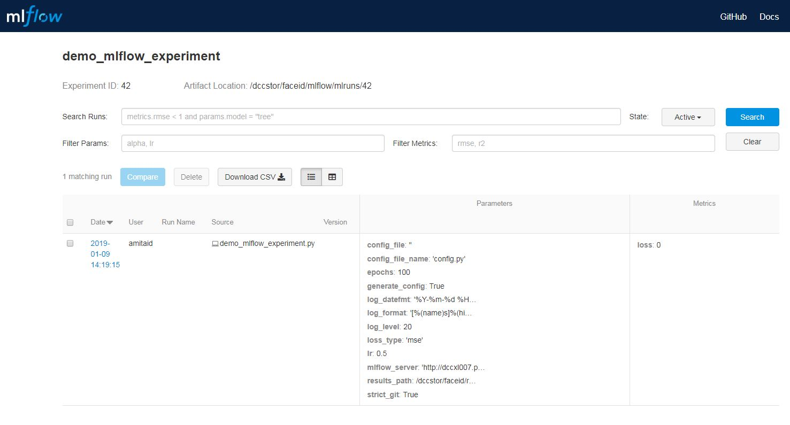
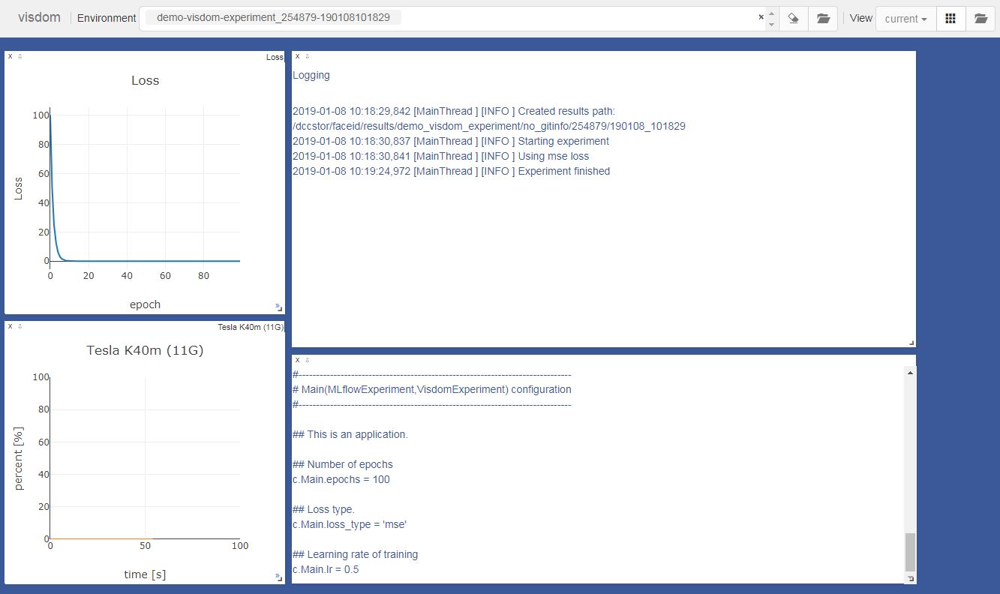
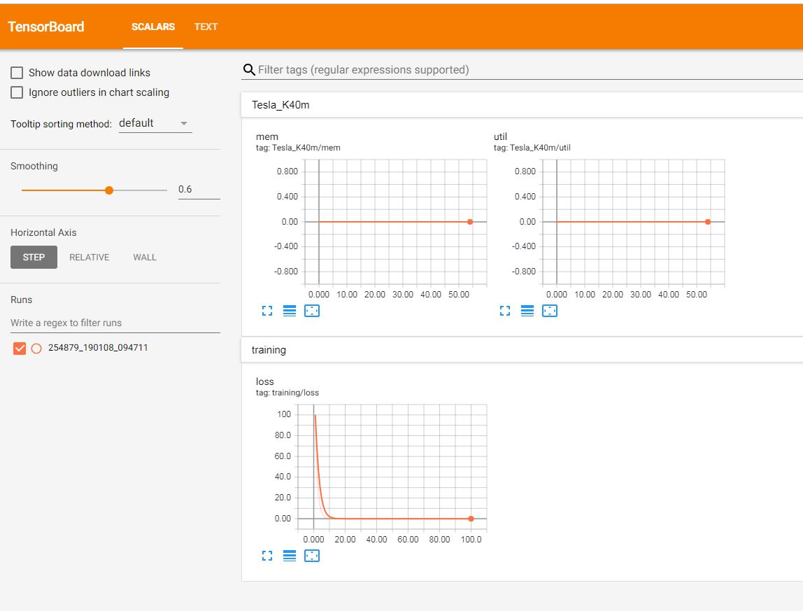
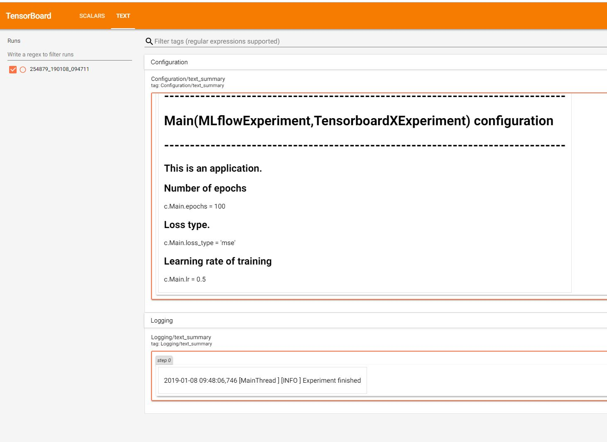

=====
Usage
=====

Basic Usage
-----------

The `experiment` package exposes the `Application` framework of Traitlets_ and extends it with other utilities to
ease writing experiments in python.

The `experiment` package replaces the entry point of python script (typically a ``def main(...):``) function with a
subclass of the ``experiment.Experiment`` class. Here is the most basic way to use `experiment` in a project::

    from experiment import Experiment

    class Main(Experiment):
        """The entry point of the script is a class the inherits from
        ``experiment.Experiment`` or from one of its subclasses.
        """

        #
        # Script arguments are exposed as Trailtes class members.
        #
        epochs = Int(100, config=True, help="Number of epochs")
        ...

        def run(self):
            """The script code starts here. The user should overwrite the ``run()`` method."""
            ...

    if __name__ == "__main__":
        main = Main()
        main.initialize()
        main.start()

The above code creates a unique results folder::

    <RESULTS_BASE>/demo_experiment/no_gitinfo/254879/190108_092800/

The first part of the path defaults to ``/tmp/results/`` and can be set using the ``RESULTS_BASE`` environment
variable. Next is the name of the script, followed by git commit hash, job id (in case the scripts is run using
a job queue system). The last part of the path is a time signature. This method ensures a unique results folder
even if several instances of the scripts are scheduled (by the jobs system) to run at the same time.
Four files are created automatically in this folder:

* ``cmdline.txt``: a copy of the command (including arguments) used for running the script.
* ``config.py``: a config file that can be use to repeat the same experiment.
* ``git_diff.txt``: the output of running ``git diff`` in the base folder of the script.
* ``script_log``: a copy of the script logs (logs created through python `logging` mechanism).

The user can access the results folder by the ``self.results_path`` member of the ``experiment.Experiment``
object.

Here is an the ``demo_experiment.py`` example from the ``examples`` folder::

    from experiment import Experiment
    import logging
    import time
    from traitlets import Enum, Float, Int, Unicode
    from tqdm import trange

    class Main(Experiment):
        #
        # Description of the experiment. Used in the help message.
        #
        description = Unicode("Basic experiment.")

        #
        # Parameters of experiment
        #
        epochs = Int(100, config=True, help="Number of epochs")
        lr = Float(0.1, config=True, help="Learning rate of training")
        loss_type = Enum(("mse", "l1"), config=True, default_value="mse",
                          help="Loss type.")

        def run(self):
            """Running the experiment"""

            logging.info("Starting experiment")
            logging.info("Using {} loss".format(self.loss_type))

            loss = 100
            for i in trange(self.epochs):
                loss = loss * self.lr
                time.sleep(.5)

            logging.info("Experiment finished")

    if __name__ == "__main__":
        main = Main()
        main.initialize()
        main.start()

The help of the script is automatically created from the help strings of the parameters::

    $ python demo_experiment.py --help
    Basic experiment.

    Options
    -------

    Arguments that take values are actually convenience aliases to full
    Configurables, whose aliases are listed on the help line. For more information
    on full configurables, see '--help-all'.

    --log-level=<Enum> (Application.log_level)
        Default: 30
        Choices: (0, 10, 20, 30, 40, 50, 'DEBUG', 'INFO', 'WARN', 'ERROR', 'CRITICAL')
        Set the log level by value or name.
    --epochs=<Int> (Main.epochs)
        Default: 100
        Number of epochs
    --loss_type=<Enum> (Main.loss_type)
        Default: 'mse'
        Choices: ('mse', 'l1')
        Loss type.
    --lr=<Float> (Main.lr)
        Default: 0.1
        Learning rate of training

    To see all available configurables, use `--help-all`

The user can set the script parameters from the command line::

    $ python demo_experiment.py --lr 0.001 --epochs 40

The user can also rerun a previous experiment by the automatically created ``config.py`` file::

    $ python demo_experiment.py --Main.config_file <RESULTS FOLDER>/config.py

Integration with mlflow
-----------------------

mlflow_ is a platform for running machine learning algorithms. To use `experiment` with `mlflow` (currnetly
only the  Tracking_ module of `mlflow` is supported) there is a need to replace ``experiment.Experiment``
with ``experiment.MLflowExperiment``. This will automatically connect to a running `mlflow` server (the `URL`
of the server can be set using the ``MLFLOW_SERVER`` environment variable). `experiment` will create a new
`mlflow` experiment using the name of the script, and will log the script arguments as key-value parameters.
See ``examples/demo_mlflow_experiment.py`` for a demonstration of using `mlflow` with `experiment`.

Integration with visdom
-----------------------

visdom_ is a tool for live visualizations. ``experiment.VisdomExperiment`` simplifies the use of `visdom`
together with the `experiment` package. When run, the script automatically connects to a `visdom` server
(the ``VISDOM_SERVER_URL``, ``VISDOM_USERNAME``, and ``VISDOM_PASSWORD`` environment variables can be
used to config the connection). A unique `visdom` ``environemnt`` is created per run (the name of the
``environment`` is set similarly to the results folder).  The script parameters and logs are automatically
saved as ``text`` windows. A separate window is created for monitoring GPU use.
The `experiment` package also includes ``experiment.visdom.Line`` and ``experiment.visdom.Window`` to help in
using `visdom`.  It is also possible to use both `mlflow` and `visdom`. See
``examples/demo_visdom_experiment.py`` for a demonstration of using `visdom` and `mlflow` with `experiment`.

The ``experiment.visdom`` module includes also support for `visdom` properties_ window. See
``examples/demo_visdom_experiment.py`` and the documentation.

Integration with Tensorboard
----------------------------

Tensorboard_ is another tool for live visualizations. ``experiment.TensorboardXExperiment`` integrates with
`Tensorboard` through TensorboardX_. When run, the script automatically creates a unique tensorboard logdir
and instantiates a ``tensorboard.SummaryWriter`` object. The script parameters and logs are saved as text
summaries. The GPU usage is also monitored using ``scalar`` summary.
It it also possible to use both `mlflow` and `tensorboard`. See ``examples/demo_tensorboardx_experiment.py``
for a demonstration of using `tensorboard` and `mlflow` with `experiment`.

.. _Traitlets: https://traitlets.readthedocs.io/en/stable/index.html
.. _mlflow: https://mlflow.org/
.. _Tracking: https://mlflow.org/docs/latest/tracking.html
.. _visdom: https://github.com/facebookresearch/visdom
.. _Tensorboard: https://www.tensorflow.org/guide/summaries_and_tensorboard
.. _TensorboardX : https://github.com/lanpa/tensorboardX
.. _properties: https://github.com/facebookresearch/visdom#visproperties
